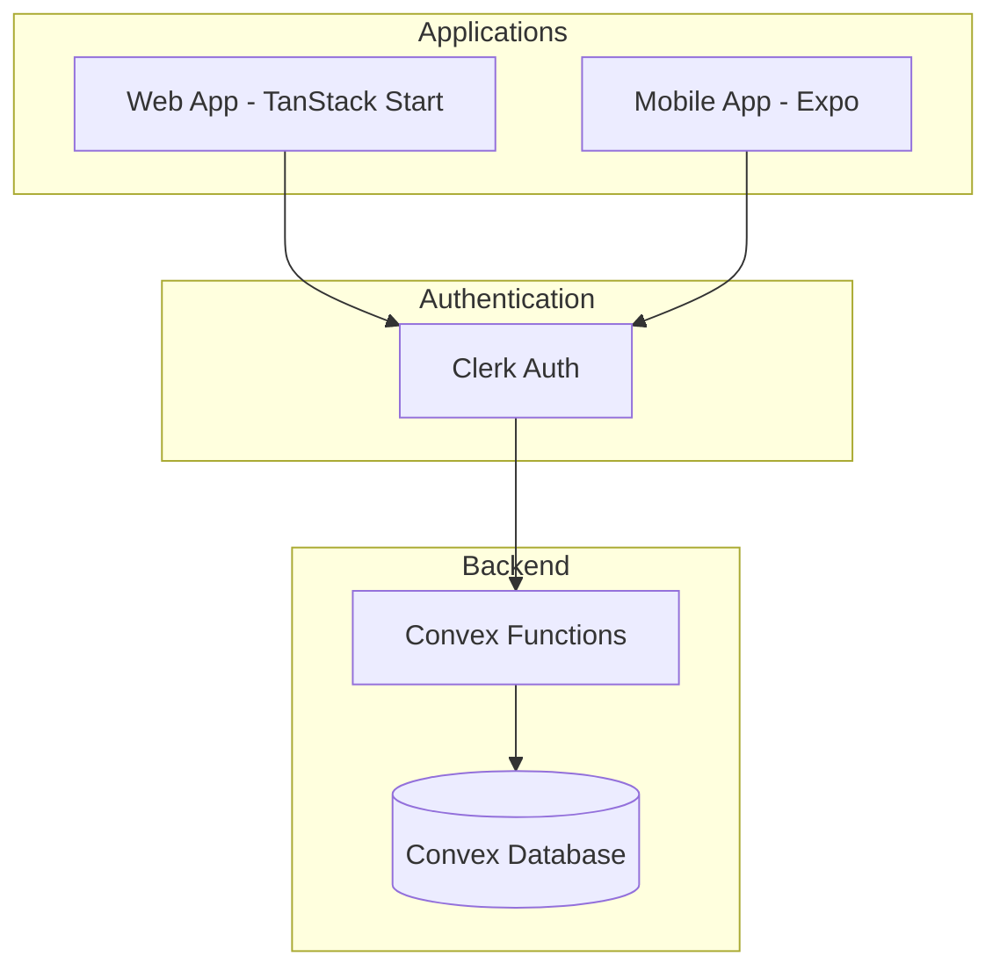

# Agent Guide: Spoonful

This document helps AI agents understand and work with the Spoonful codebase.

## What is Spoonful?

Spoonful is a **household chore management app** built around "spoon theory" — the idea that people have a limited number of "spoons" (energy units) each day. It helps households (couples, families, roommates, polycules) manage chores while respecting individual energy constraints due to ADHD, mental health, chronic illness, etc.

### Core Features

- **Household Management**: Create/join households via invite codes
- **Chore Definitions**: Define chores with frequencies (daily, weekly, monthly, custom intervals)
- **Personal Energy Costs**: Each person rates how many "spoons" (1-5) each chore costs them
- **Daily Energy Check-in**: Simple red/yellow/green energy level tracking
- **Smart Allocation**: Chores assigned based on energy, preferences, and fairness
- **Fairness Tracking**: Ensures equitable distribution of unpleasant tasks

---

## Architecture Overview

```
spoonful-react/
├── apps/
│   ├── web/              # TanStack Start web application
│   └── mobile/           # Expo React Native app
├── packages/
│   └── convex/           # Shared Convex backend (database + functions)
├── biome.json            # Shared linting/formatting config
└── package.json          # Monorepo root with npm workspaces
```

### Data Flow



---

## Tech Stack

| Layer | Technology |
|-------|------------|
| **Monorepo** | npm workspaces |
| **Web App** | TanStack Start (Vite-based), React 19, Tailwind CSS |
| **Mobile App** | Expo with expo-router, React Native |
| **Backend** | Convex (serverless database + functions) |
| **Auth** | Clerk (integrated with Convex) |
| **Linting/Formatting** | Biome |
| **Runtime** | Bun (preferred) or npm |

---

## Domain Model

### Database Schema (`packages/convex/convex/schema.ts`)

| Table | Purpose |
|-------|---------|
| `users` | Users synced from Clerk (clerkId, email, name, avatarUrl) |
| `households` | Groups of users (name, inviteCode, createdBy) |
| `householdMembers` | Join table: users ↔ households with role (admin/member) |
| `chores` | Chore definitions (name, frequency, defaultSpoonCost, isUnpleasant) |
| `chorePreferences` | Per-user spoon cost overrides for each chore |
| `dailyStatus` | Daily energy check-ins (red/yellow/green) |
| `choreAssignments` | Daily chore assignments (who does what, completed/skipped) |
| `choreCompletions` | Historical tracking for fairness calculations |

### Key Domain Concepts

- **Spoon Cost** (1-5): How much energy a chore takes. Each person can set their own cost per chore.
- **Energy Level**: Daily check-in status
  - 🔴 **Red**: Low energy day (fewer chores assigned)
  - 🟡 **Yellow**: Medium energy (default if not set)
  - 🟢 **Green**: Good energy day (can take on more)
- **Frequency**: How often a chore needs doing (daily, weekly, monthly, or every N days)
- **Unpleasant Flag**: Marks chores that nobody likes (tracked for fair distribution)

---

## Key Code Patterns

### Convex Functions (`packages/convex/convex/`)

All Convex functions use auth helpers from `lib/auth.ts`:

```typescript
import { requireCurrentUser, isHouseholdMember, isHouseholdAdmin } from "./lib/auth";

export const myQuery = query({
  args: { householdId: v.id("households") },
  handler: async (ctx, args) => {
    const user = await requireCurrentUser(ctx);  // Throws if not authenticated
    
    if (!(await isHouseholdMember(ctx, user._id, args.householdId))) {
      throw new Error("Not a member of this household");
    }
    
    // ... rest of query
  },
});
```

**Function files:**
- `users.ts` - User sync from Clerk
- `households.ts` - CRUD for households, join/leave
- `chores.ts` - Chore definitions and preferences
- `dailyStatus.ts` - Energy check-ins
- `assignments.ts` - Daily chore assignments, completion, fairness stats

### Web App Routes (`apps/web/src/routes/`)

File-based routing with TanStack Router:

```
routes/
├── __root.tsx              # Root layout (Clerk + Convex providers)
├── index.tsx               # Landing page / dashboard
└── household/
    ├── new.tsx             # Create household
    ├── join.tsx            # Join via invite code
    └── $householdId/
        ├── index.tsx       # Household dashboard
        └── chores.tsx      # Manage chores
```

**Pattern for route components:**

```typescript
import { createFileRoute } from "@tanstack/react-router";
import { useQuery, useMutation } from "convex/react";
import { api } from "@spoonful/convex/convex/_generated/api";
import type { Id } from "@spoonful/convex/convex/_generated/dataModel";

export const Route = createFileRoute("/household/$householdId")({
  component: HouseholdPage,
});

function HouseholdPage() {
  const { householdId } = Route.useParams();
  const household = useQuery(api.households.get, {
    householdId: householdId as Id<"households">,
  });
  // ...
}
```

### Styling (`apps/web/src/styles.css`)

CSS variables design system with soft pastel palette:

```css
:root {
  /* Colors */
  --color-cream: #faf8f5;
  --color-sage: #a8c5a8;        /* Primary green */
  --color-lavender: #c5b8d9;    /* Secondary purple */
  --color-peach: #f5cdb6;       /* Accent */
  
  /* Energy colors */
  --color-energy-red: #e8a8a8;
  --color-energy-yellow: #f5e0a8;
  --color-energy-green: #a8d9a8;
  
  /* Typography */
  --font-sans: "Quicksand", system-ui, sans-serif;
  --font-display: "Comfortaa", system-ui, sans-serif;
}
```

**CSS classes available:** `.card`, `.btn`, `.btn-primary`, `.btn-secondary`, `.btn-soft`, `.energy-badge`, `.energy-red`, `.energy-yellow`, `.energy-green`, `.loading`, `.spinner`, `.encouragement`

---

## Development Commands

```bash
# Install dependencies
bun install

# Start Convex dev server (terminal 1)
bun run dev:convex

# Start web app (terminal 2)
bun run dev

# Start mobile app
bun run dev:mobile

# Linting
bun run lint           # Check
bun run lint:fix       # Auto-fix

# Formatting
bun run format
```

---

## Environment Variables

### Web App (`apps/web/.env.local`)

```
VITE_CONVEX_URL=your_convex_deployment_url
VITE_CLERK_PUBLISHABLE_KEY=your_clerk_publishable_key
```

### Mobile App (`apps/mobile/.env`)

```
EXPO_PUBLIC_CONVEX_URL=your_convex_deployment_url
EXPO_PUBLIC_CLERK_PUBLISHABLE_KEY=your_clerk_publishable_key
```

---

## Code Style (Biome)

- **Indentation**: Tabs
- **Quotes**: Double quotes
- **Semicolons**: Always
- **Trailing commas**: All
- **Line width**: 100 characters
- **Import organization**: Auto-sorted

Run `bun run lint:fix` to auto-format.

---

## Important Notes for Agents

1. **Auth is required**: Almost all Convex functions require authentication. Use `requireCurrentUser(ctx)` at the start.

2. **Household membership checks**: Always verify the user is a member of the household before returning data.

3. **Convex IDs**: When passing IDs from route params, cast them: `householdId as Id<"households">`

4. **Soft deletes**: Chores use soft delete (`isActive: false`) rather than hard delete.

5. **Date format**: Dates in the DB are stored as `YYYY-MM-DD` strings for daily records.

6. **React 19**: The web app uses React 19 with the new JSX transform.

7. **Accessibility focus**: The app is designed for users with energy limitations. Keep the UI calm, encouraging, and non-judgmental.
